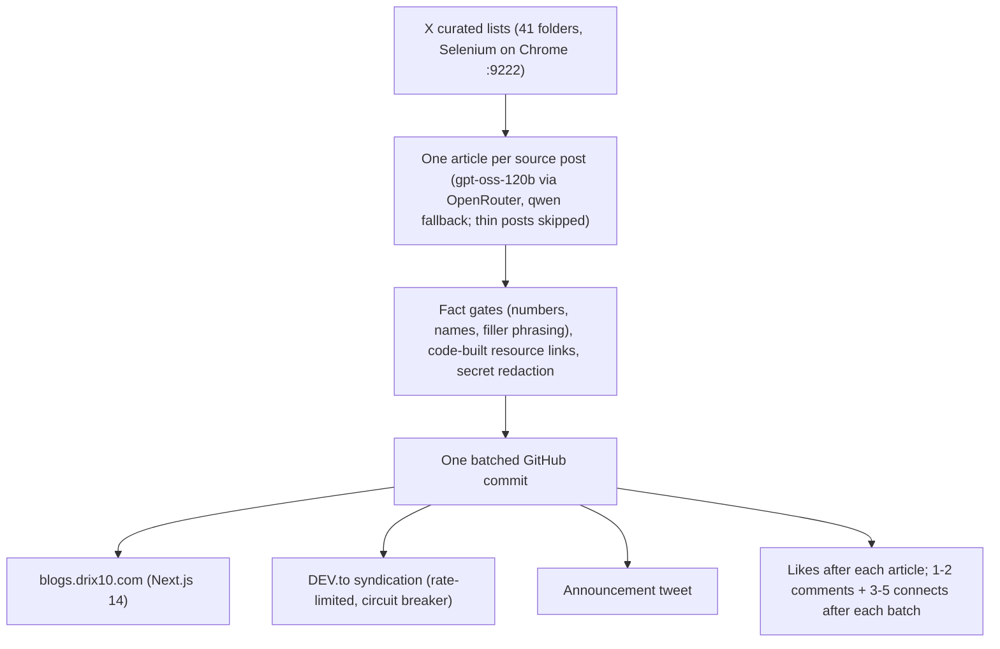

<p align="center">
  
</p>

<h1 align="center">⚡ Autonomous AI Knowledge & Multi-Channel Syndication Engine</h1>

<p align="center">
  <strong>Continuous Technical Curation • OpenRouter LLM Pipeline • Next.js Knowledge Hub • Live GitHub Portfolio</strong>
</p>

<p align="center">
  <a href="https://blogs.drix10.com"></a>
  
  
</p>

<p align="center">
  
</p>

---

## 📖 Overview

**ai-resources-pipeline** is an autonomous curation and syndication engine built by **Drishtant Ghosh** ([@Drix10](https://github.com/Drix10)). It scrapes curated X lists, turns the best threads into grounded technical articles, publishes them to GitHub, [blogs.drix10.com](https://blogs.drix10.com) and DEV.to, and engages on LinkedIn with genuine, gated peer comments and likes.

---

## 🏛️ System Architecture


```mermaid
flowchart TD
    A["X curated lists (41 folders, Selenium on Chrome :9222)"] --> B["One article per source post (gpt-oss-120b via OpenRouter, qwen fallback; thin posts skipped)"]
    B --> C["Fact gates (numbers, names, filler phrasing), code-built resource links, secret redaction"]
    C --> D["One batched GitHub commit"]
    D --> E["blogs.drix10.com (Next.js 14)"]
    D --> F["DEV.to syndication (rate-limited, circuit breaker)"]
    D --> G["Announcement tweet"]
    D --> H["Likes after each article; 1-2 comments + 3-5 connects after each batch"]
```

---

## ✨ Key Features

### 🧠 1. Grounded Article Generation
- Up to 16 pre-vetted posts per folder, one article per post (never several posts in one call). The writer is `openai/gpt-oss-120b` on OpenRouter, picked by benchmark over 9 models on 30 real posts (judged for faithfulness, specificity and publishability), about $0.0001 per article. Posts with nothing concrete are skipped, not padded; a file ships with 2-8 articles.
- Resource links come from the post itself, built in code, so none are invented, empty or duplicated. Every number and name in an article must appear in the post, filler phrasing and banned words are rejected, and a rejected article gets one retry with the reasons.
- Code blocks in generated articles are preserved as written.

### 💬 2. LinkedIn Comment Engine
- Short peer comments (congrats, honest ACK, or skip), checked by mechanical gates plus a semantic critic. If the critic is unavailable the comment is not posted.
- 15/day cap, 3-day memory for rejected posts, like-only mode via `LINKEDIN_LIKE`.
- English only: posts in other languages are never liked, followed or commented on, and a non-English draft is rejected.
- Providers: OpenRouter (DeepSeek V4 Flash; set `OPENROUTER_MODEL_OVERRIDE` to change it) first, then the NVIDIA/Ollama comment model.
- Preview without posting: `node feed-preview.js --max 3`. Regression checks: `node feed-regression.js`.

### 🛡️ 3. Safety Guardrails
- Credentials, webhook URLs, private keys and internal IPs are stripped before anything is committed.

### 🎲 Randomized Batch GitHub Commits (1 to 8)
- Eliminates predictable static commit batching by randomly committing between 1 and 8 article updates per cycle, creating a natural commit rhythm on GitHub.

### 🤝 4. LinkedIn Feed Engagement (woven into the run)
- **Flow**: write one article, then a random 2-4 likes; repeat until the batch (a random 1-8 articles, re-rolled every batch) is committed; then 1 or 2 comments and 3-5 connection requests; then the next batch. Content generation never depends on LinkedIn, and every LinkedIn step is non-fatal. Posts come from finance/AI/founder content search plus optional creators in `config/creators.json`; `LINKEDIN_SOURCE=feed` restores home-feed sourcing.
- **Caps**: 15 comments, 40 likes, 30 connections per day (100 per week); 3-day rejection memory. English only.
- **Typing fallback**: if keystrokes do not land (an unattended window without focus), the comment is inserted with the editor's own insert command and read back before submitting.
- **Reaction-First Voice**: short acknowledgments by default, observation only when the post invites it; never invents facts, numbers, or relationships.
- **Preview Before Live**: `node feed-preview.js --max 3` prints exactly what would be posted and liked — nothing runs live without approval.

### ⚡ 5. High-Speed Next.js 14 Knowledge Hub (`blog/`)
- **1,800+ Articles** across **42 Specialized Domains**, with static topic and archive pages so everything caches at the edge.
- **SEO**: per-digest share images (`/og/<slug>`), Article/Breadcrumb/CollectionPage structured data, a sitemap of every indexable URL, search results kept out of the index. Audit any deployment with `npm run seo:audit -- <url>`.
- **Sub-60ms In-Memory Search & Filtering** with tokenized search indexes (`blog/lib/articles-index.json`).
- **Hybrid Incremental Static Regeneration (ISR)**: Builds in under 8 seconds with zero worker timeouts.
- **Live Deployment**: Hosted at [https://blogs.drix10.com](https://blogs.drix10.com).

---

## 🛠️ Tech Stack

- **Pipeline**: Node.js, Octokit REST, Selenium WebDriver, Winston Logger
- **AI Models**: OpenRouter (`openai/gpt-oss-120b` for articles, `deepseek/deepseek-v4-flash` for comments); optional NVIDIA NIM or local Ollama as comment fallbacks
- **Frontend / Web**: Next.js 14 (App Router), React 18, TypeScript, Tailwind CSS. `blog/` is the knowledge hub; `portfolio/` is [drix10.com](https://drix10.com), which reads projects, open-source work and the contribution graph live from GitHub and draws the Night-Hunt mice behind the name (after [ml-videos](https://github.com/Drix10/ml-videos)).
- **Syndication**: DEV.to API, LinkedIn feed engagement, GitHub Octokit REST

---

## 🚀 Quick Start

### 1. Installation
```bash
git clone https://github.com/Drix10/ai-resources-pipeline.git
cd ai-resources-pipeline
npm install
cd blog && npm install && cd ..
```

### 2. Environment Setup (`.env`)
```env
# GitHub Knowledge Sync & Live Pulse
GITHUB_PAT=your_github_personal_access_token
GITHUB_USERNAME=Drix10
GITHUB_REPONAME=ai-resources

# AI LLM Engine Configuration
LOCAL_LLM=false
OPENROUTER_API_KEY=your_openrouter_api_key
# Optional fallbacks
# NVIDIA_API_KEY=your_nvidia_nim_api_key

# Social Automation
LINKEDIN_LIKE=true
LINKEDIN_FEED_REPLY=true
LINKEDIN_CONNECT=true
DISCORD_WEBHOOK_URL=your_discord_webhook_url
```

### 3. Running the Engine
```bash
# Start Chrome with remote debugging (attaches to your logged-in session)
node start-app.js

# Preview feed engagement (comments + likes) without posting anything
node feed-preview.js --max 3
```

---

### 4. Deploying the sites
Set `NEXT_PUBLIC_SITE_URL` (portfolio) and `CANONICAL_BASE_URL` (blog) to the exact public address, and `GITHUB_READ_TOKEN` on the portfolio. Optional: `GOOGLE_SITE_VERIFICATION`, `BING_SITE_VERIFICATION`.

---

## 📄 License
MIT License © 2026 [Drix10](https://drix10.com)
