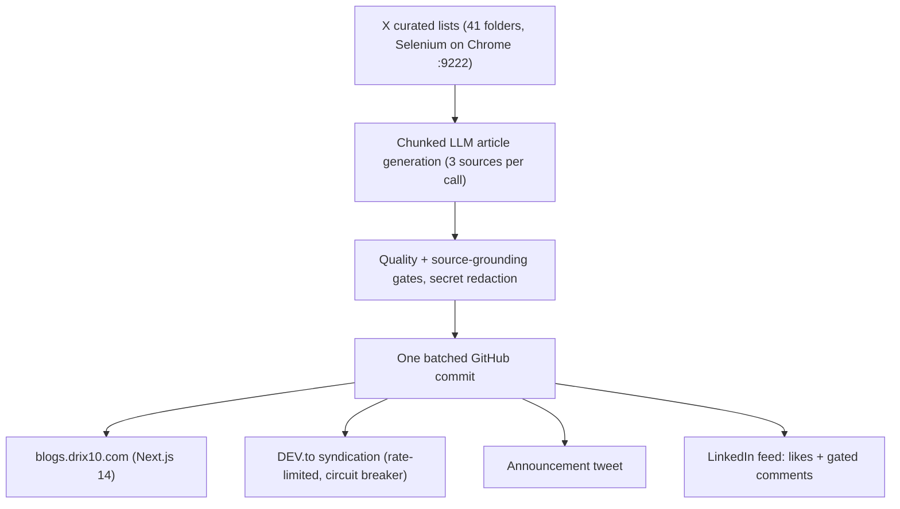

<p align="center">
  
</p>

<h1 align="center">⚡ Autonomous AI Knowledge & Multi-Channel Syndication Engine</h1>

<p align="center">
  <strong>Continuous Technical Curation • Dual-Engine LLM Pipeline • Next.js Knowledge Hub • Automated DEV.to Syndication</strong>
</p>

<p align="center">
  <a href="https://blogs.drix10.com"></a>
  
  
</p>

<p align="center">
  
</p>

---

## 📖 Overview

**ai-resources-pipeline** is an autonomous curation and syndication engine built by **Drishtant Ghosh** ([@Drix10](https://github.com/Drix10)). It scrapes curated X lists, turns the best threads into grounded technical articles, publishes them to GitHub, [blogs.drix10.com](https://blogs.drix10.com) and DEV.to, and engages on LinkedIn with genuine, gated peer comments and likes.

---

## 🏛️ System Architecture


```mermaid
flowchart TD
    A["X curated lists (41 folders, Selenium on Chrome :9222)"] --> B["Chunked LLM article generation (3 sources per call)"]
    B --> C["Quality + source-grounding gates, secret redaction"]
    C --> D["One batched GitHub commit"]
    D --> E["blogs.drix10.com (Next.js 14)"]
    D --> F["DEV.to syndication (rate-limited, circuit breaker)"]
    D --> G["Announcement tweet"]
    D --> H["LinkedIn feed: likes + gated comments"]
```

---

## ✨ Key Features

### 🧠 1. Grounded Article Generation
- Ten pre-vetted threads per folder are generated in chunks of three, so no single call has to fit ten articles. Chunks that fail validation are dropped, and the file ships only if the survivors cover at least half the sources.
- Deterministic gates reject 3rd-person boilerplate, ungrounded links and invented implementation sections.

### 💬 2. LinkedIn Comment Engine
- Short peer comments (congrats, honest ACK, or skip), checked by mechanical gates plus a semantic critic. If the critic is unavailable the comment is not posted.
- 15/day cap, 3-day memory for rejected posts, like-only mode via `LINKEDIN_LIKE`.
- Providers: OpenRouter (`OPENROUTER_MODEL`) first, then the NVIDIA/Ollama comment model.
- Preview without posting: `node feed-preview.js --max 3`. Regression checks: `node feed-regression.js`.

### 🛡️ 3. Safety Guardrails
- Credentials, webhook URLs, private keys and internal IPs are stripped before anything is committed.

### 🎲 Randomized Batch GitHub Commits (1 to 8)
- Eliminates predictable static commit batching by randomly committing between 1 and 8 article updates per cycle, creating a natural commit rhythm on GitHub.

### 🤝 4. LinkedIn Feed Engagement (2 comments + likes per commit)
- **Interleaved With Commits**: after every successful batch commit, the engine likes fresh feed posts and leaves up to 2 genuine comments (Top, then Recent) — 15/day cap, 3-day rejection memory.
- **Reaction-First Voice**: short acknowledgments by default, observation only when the post invites it; never invents facts, numbers, or relationships.
- **Preview Before Live**: `node feed-preview.js --max 3` prints exactly what would be posted and liked — nothing runs live without approval.

### ⚡ 5. High-Speed Next.js 14 Knowledge Hub (`blog/`)
- **8,940+ Verified Technical Guides** across **42 Specialized Domains**.
- **Sub-60ms In-Memory Search & Filtering** with tokenized search indexes (`blog/lib/articles-index.json`).
- **Hybrid Incremental Static Regeneration (ISR)**: Builds in under 8 seconds with zero worker timeouts.
- **Live Deployment**: Hosted at [https://blogs.drix10.com](https://blogs.drix10.com).

---

## 🛠️ Tech Stack

- **Pipeline**: Node.js, Octokit REST, Selenium WebDriver, Winston Logger
- **AI Models**: NVIDIA NIM Cloud API (`meta/llama-3.2-11b-vision-instruct`) / Local Ollama (`gemma4`)
- **Frontend / Web**: Next.js 14 (App Router), React 18, TypeScript, Tailwind CSS
- **Syndication**: DEV.to API, LinkedIn feed engagement, GitHub Octokit REST

---

## 🚀 Quick Start

### 1. Installation
```bash
git clone https://github.com/Drix10/ai-resources-pipeline.git
cd ai-resources-pipeline
npm install
cd blog && npm install && cd ..
```

### 2. Environment Setup (`.env`)
```env
# GitHub Knowledge Sync & Live Pulse
GITHUB_PAT=your_github_personal_access_token
GITHUB_USERNAME=Drix10
GITHUB_REPONAME=ai-resources

# AI LLM Engine Configuration
LOCAL_LLM=false
NVIDIA_API_KEY=your_nvidia_nim_api_key
NVIDIA_MODEL=meta/llama-3.2-11b-vision-instruct

# Social Automation
LINKEDIN_LIKE=true
LINKEDIN_FEED_REPLY=true
DISCORD_WEBHOOK_URL=your_discord_webhook_url
```

### 3. Running the Engine
```bash
# Start Chrome with remote debugging (attaches to your logged-in session)
node start-app.js

# Preview feed engagement (comments + likes) without posting anything
node feed-preview.js --max 3
```

---

## 📄 License
MIT License © 2026 [Drix10](https://drix10.com)
