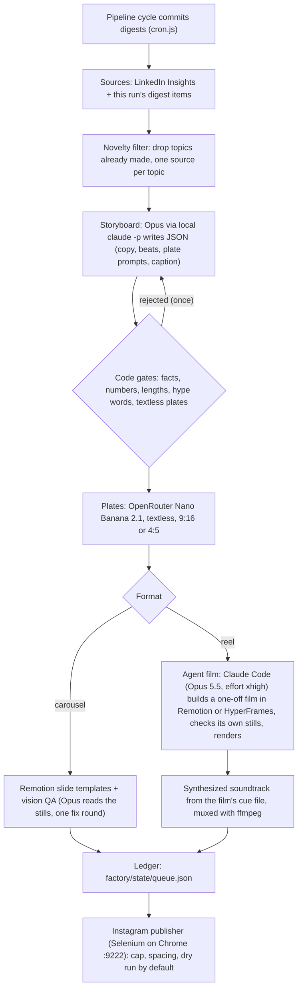

# Instagram content factory

The factory turns the articles this pipeline already writes into Instagram reels and carousels. Each reel is a one-off film built in code by Opus 5.5, running through your local Claude Code. It is off until you set `FACTORY_ENABLED=true`, and nothing is posted until you set `IG_POST=true`.

## How a piece is made



This follows the same order as the motion galleries (motionpromptgallery.com, prompt-motion.com) and the two reference repos (`Leonxlnx/claude-launchvideo`, `mexicat/pdoom-video`): a text beat sheet first, then a code-rendered film, then still checks and fixes, then the render. The one step we add is image generation. The galleries never use image models. Here, generated images are textless mood plates only, and every word on screen is rendered live in code. This avoids the garbled AI text the galleries ban.

## Where things run

| Step | Runs on | Needs |
| --- | --- | --- |
| Storyboard, vision QA, agent films | Your machine (the one that runs `npm start`), via `claude -p` | Claude Code installed and signed in with your Claude plan. **No Anthropic API key.** |
| Plates | OpenRouter `POST /images` | `OPENROUTER_API_KEY` (already in `.env` for the articles) |
| Rendering | Your machine: Remotion (`factory/node_modules`), headless Chromium, ffmpeg | `npm run factory:install`, ffmpeg on PATH |
| Posting | The Chrome on `:9222` that the X and LinkedIn services already use | Log in to instagram.com once in that window |

Opus runs with `--model claude-opus-5-5 --effort xhigh` ("extra" effort). Change these with `FACTORY_OPUS_MODEL` and `FACTORY_CLAUDE_EFFORT`. If the pipeline has to run on a server without Claude Code, set `FACTORY_OPUS_BACKEND=anthropic` or `=openrouter` to use an API key instead.

## Every reel is unique

- **New topic.** Each source gets a TF-IDF signature (the title weighted ×4, plus the body), compared against the recent pieces and the rest of the pool. A cosine of 0.28 or more counts as the same topic. On the current LinkedIn Insights this collapses 24 posts into 15–16 distinct topics. For example, the three struct-padding posts become one, and so do the two webhook-HMAC posts. Once a topic has been made, its near-duplicates are skipped from then on.
- **New look.** Every agent film writes `out/look.json` describing its visual idea, palette, fonts, technique and engine. The next agent receives the last `FACTORY_NOVELTY_WINDOW` (15) looks under "do not reuse". The brand only fixes the end lockup (author + handle) and the legibility rules. Everything else is chosen per film. The house fonts and palette are offered as optional defaults, not as the look.
- **New structure.** The storyboard writer also sees recent hooks and pattern ids, and is told to use a different hook shape and structure.
- **Engines.** `FACTORY_HERO_ENGINE=auto` alternates between Remotion and HyperFrames from film to film.
- **No templated fallback.** By default, a failed agent film is marked failed and retried next cycle rather than replaced by a template (`FACTORY_TEMPLATE_FALLBACK=false`). Each source gets two attempts, and a cycle stops after `perCycle + 2` failures so it can't burn through your plan.

Carousels (4:5 still posts) use the Remotion slide templates, with a theme picked per piece.

## Skills the agent can use

Install these into your local Claude Code. The agent is told to invoke whatever is listed in `FACTORY_HERO_SKILLS`.

```bash
# Remotion (official)
claude plugin marketplace add remotion-dev/claude-code-plugin
claude plugin install remotion@remotion
# HyperFrames (HeyGen): HTML + GSAP -> MP4
claude plugin marketplace add heygen-com/hyperframes
claude plugin install hyperframes@hyperframes
```

```env
FACTORY_HERO_SKILLS=/remotion-best-practices,/hyperframes:hyperframes
FACTORY_HERO_ENGINE=auto
```

The agent can only use file tools plus `npx remotion`, `npx hyperframes`, `npm install`, `ffmpeg`, `ffprobe`, `node`, `ls`, `mkdir` and `cp`. It works in a per-piece workspace under `factory/state/jobs/<job>/agent-<engine>/`, never in the repo itself.

## Fact safety

Opus designs the motion, but it cannot change what the piece claims.

1. The storyboard is the only place where on-screen words are decided, and `storyboard.js#validate` checks them against the source article:
   - every number above 10 that appears on screen or in the caption must be in the article (code blocks are exempt);
   - quotes must be verbatim from the article;
   - the pipeline's `BANNED_WORDS` list (shared with `llm.js`) is rejected;
   - emojis are not allowed on screen;
   - plate prompts may not ask for text or logos;
   - every Instagram-safe length limit is enforced.
2. The agent receives that wording as **FIXED WORDING**. It may split lines across beats or drop at most one line, but it may not add claims.
3. The soundtrack is synthesized by `src/factory/soundtrack.js` from the film's cue times: kick, hats, bass, pad, riser and impacts at 120 bpm in A minor, mastered at roughly −13 LUFS. It is original audio, so there is nothing to clear.

## Files

```
factory/                      Remotion package (own package.json, like blog/)
  src/schema.ts               storyboard contract (scenes, slides, plates)
  src/brand.ts                tokens from blogs.drix10.com, Instagram safe zones
  src/Reel.tsx, Carousel.tsx  9:16 reel and 4:5 slide compositions
  src/scenes/ReelScenes.tsx   hook, plate, code, stat, list, compare, quote, cta
  library/patterns.json       storyboard patterns (myth-number, versus, teardown, ...)
  library/videos/<slug>/      YOUR Opus video library: meta.json + prompt.md (+ src/)
  fixtures/struct-padding.json  sample storyboard (studio default, tests)
src/factory/
  index.js       orchestrator: produce(), runCycle(), publishDue()
  storyboard.js  Opus director + code gates
  plates.js      OpenRouter image plates (cached by prompt hash)
  hero.js        Claude Code agent films (Remotion / HyperFrames)
  render.js      Remotion renders, contact sheets, ffmpeg mux
  qa.js          Opus vision check on rendered stills
  novelty.js     topic dedupe + look memory
  sources.js     LinkedIn Insights + digest items -> sources
  opus.js        claude -p client (API fallbacks optional)
  soundtrack.js  beat-locked synth
  instagram.js   Selenium publisher
  queue.js       ledger at factory/state/queue.json
factory-run.js   CLI
```

## Your Opus video library

Put each video you want the agent to learn from in `factory/library/videos/<slug>/`:

- `meta.json`: `title`, `formats`, `tags`, `score` (1–5) and `why` (one line on what makes it work).
- `prompt.md`: the prompt that produced the video.
- `src/` (optional): the code Opus wrote.

The two films whose tags best match the article are passed to the agent as references, with read access to their `src/`. Their `why` lines also go into the storyboard prompt. Two entries are seeded from the reference repos. See `factory/library/videos/README.md`.

## Run it

```bash
npm run factory:install                 # once: Remotion into factory/node_modules
npm i -g @anthropic-ai/claude-code && claude   # once: sign in with your Claude plan
npm run factory:sample                  # render the bundled sample reel + carousel (no keys, no Claude)
node factory-run.js --list              # candidate sources, best first
node factory-run.js --source "LinkedIn Insights/<file>.md" --format reel   # one piece now
node factory-run.js --queue             # ledger
node factory-run.js --publish --dry     # walk Instagram's upload flow, stop before Share, discard
npm run factory:studio                  # Remotion Studio for the templates
```

With `FACTORY_ENABLED=true`, `npm start` runs a factory pass at the end of every cycle, after the blog sync. It makes up to `FACTORY_PER_CYCLE` pieces and posts at most one, within `IG_DAILY_CAP` and `IG_MIN_GAP_MINUTES`. Review a piece by opening its job folder, which contains `reel.mp4` or `slide-*.jpg`, `contact.jpg`, `caption.txt`, `storyboard.json`, `treatment.md` and `look.json`.

## Before going live

1. Run one real piece with `--source` and watch the agent log (`agent.log` in the job folder). Expect roughly 15–40 minutes per film at `xhigh`, depending on the machine. This is untested.
2. Run `--publish --dry` with Instagram logged in on `:9222`, and check the `dry-run-ready` screenshot in `factory/state/ig-debug/`. Instagram's web UI changes, so all selectors are kept in `SEL` at the top of `instagram.js`.
3. Then set `IG_POST=true`.

Browser automation on Instagram is against its terms of use and can get the account limited. The daily cap, spacing and dry-run default reduce the risk but do not remove it. The official Content Publishing API (Business/Creator account) is the safer path if that ever becomes an option.
