# Instagram content factory

The factory turns what the pipeline already writes into Instagram reels and carousels. At the end of every pipeline run it picks the one story from that run most likely to travel, researches it, and has Opus 5.5 (your local Claude Code) build it as a one-off piece in code: a narrated reel, or a designed carousel. It is off until `FACTORY_ENABLED=true`, and nothing is posted until `IG_POST=true`.

## How a piece is made

```mermaid
flowchart TD
    A["End of a pipeline run: articles committed, LinkedIn steps, blog sync (cron.js)"] --> B["Fresh sources: this run's digest items + any from the last 36 h (inbox) + Insights written in that window"]
    B --> C["Novelty filter: drop topics already made"]
    C --> P["Editor: Opus scores every story for virality (stop, stakes, proof, reach, now, share, show) and picks ONE"]
    P --> R["Deep dive: read every page the story links to (research); capture the source X post, its photos and the linked pages (real material)"]
    R --> D["Storyboard: hook, context, value, payoff, CTA in 32-50 s; per scene a headline (<= 6 words), a voiceover line and a VISUAL (real material, a stock search, or a graphic)"]
    D --> E{"Code gates: facts and numbers (screen, caption, hashtags, voice), quotes, hype words, emoji, lengths, visuals, field types"}
    E -- "rejected (once)" --> D
    E --> T["Stock: footage and photos for the scenes that asked (Pexels, Pixabay, Openverse)"]
    T --> V["Voice: ElevenLabs with audio tags (OpenRouter fallback), recorded first, word timings; a narrated reel is never made silent"]
    V --> S["Director: Opus picks 4 references for overlay and transition craft, then writes the brief against THE BAR FOR A REEL, with the storyboard's shot plan"]
    S --> U["Music: the director's track from factory/library/music (or the best fit), its drop placed on the climax, the real beat grid"]
    U --> H["Agent: Claude Code builds it (reel: Remotion or HyperFrames film cut to the music and timed to the voice, with library clips and effects; carousel: designed stills), checks its own frames, renders, writes its SFX cues"]
    H --> M["Mix: music stepped down under the voice and up in the pauses, synthesized SFX, word-by-word captions, -14 LUFS"]
    M --> K["Ledger: factory/state/queue.json"]
    K --> L["Instagram publisher (Chrome :9222): posts THIS run's piece within the cap; dry run until IG_POST=true"]
```



Every word on screen is drawn in code, so there is no garbled AI lettering and no image bill. The pictures are real: the X post the story comes from and its photos, screenshots of the pages it links to (the repo, the docs, the blog post), licensed stock footage and photos found for each scene, and the visual library's clips.

## The bar

**Reels** are held to THE BAR FOR A REEL (`REEL_BAR` in `src/factory/director.js`), written after the first live reel (an abstract motion-design film with no voice) was rejected as "2D text yapping, no images, no flow, looks generated". A reel is a story told over REAL material, led by the voice: real things on screen nearly every second with motion graphics as the layer on top (a highlighter on the line being said, a circled number, a zoom into a page); frame 0 is the hook, moving, with the claim at ~1.2-1.6 s; cuts land on the spoken word; one continuous flow tied together by a recurring device; every still moves, shots hold 1.5-3.5 s, a headline stays up long enough to read twice; one headline of at most 6 words at a time plus the captions; escalation to a payoff, one CTA, and a loop back to frame 0 with no logo outro. The arc, hook, on-screen-text and shot rules are adapted from Ootto's [claude-content-skills](https://github.com/Ootto-AI/claude-content-skills) (MIT): going-viral, reel-scripter, on-screen-text-writer, b-roll-shot-list, reel-builder. The numbers come from platform guidance and recent data: Instagram ranks reels on watch time, sends and likes per reach and reports a 3-second skip rate; brand reels of 30-60 s got the most median views in Socialinsider's 2026 study of 6M reels; hashtags are capped at 5 per post (Dec 2025); a voice of ~160 wpm reads as natural, faster sounds rushed.

**Carousels** keep THE BAR (`CRAFT_BAR`). P(doom) (`repos/pdoom-video`) and Tessel (`repos/claude-launchvideo`) show the level, not a template: each piece picks its own form (one continuous take, a machine that runs the mechanism, a single camera move, plates, a document that writes itself...), and the look memory makes consecutive pieces pick different forms, palettes and type. The bar asks for a designed world with a through-line, images that do the explaining, words integrated into the image, numbers and code staged in the world, depth and light, beat-locked motion, and typographic craft. It rejects text on a background, code cards, bullet lists, centred stat counters and boxes with arrows.

## What gets made, and from what

At the end of each run (after the articles, the LinkedIn steps and the blog sync), the factory:

1. **Collects fresh material**: the digest items this run committed, saved to `factory/state/inbox.json` so a pass that is skipped (lock held, crash, Opus down) does not lose them, plus any Insight written in the last 36 hours. With nothing new it makes nothing, unless `FACTORY_ARCHIVE_FALLBACK=true` lets it use the Insights archive.
2. **Lets an editor pick one story** (`editor.js`): Opus scores a shortlist on STOP, STAKES, PROOF, REACH, NOW, SHARE and SHOW, and picks the one most likely to go viral with engineers. The runners-up follow by score. `FACTORY_PER_CYCLE` (default 1) is the number of stories per run.
3. **Deep-dives it**: every page the story links to is read (public hosts only) and appended as research. Numbers from those pages pass the fact gate; their URLs and headers do not, and hype words in a linked README do not excuse hype in the copy.
4. **Captures real material** (`assets.js`): the X post the story comes from (rendered by X's public embed page, no login, cut out along its card as a transparent PNG) and the photos attached to it; then a desktop view, a 900-wide readable card, a full mobile page and the og:image of each linked page. Chrome sends all traffic through an in-process proxy that refuses private, local and LAN addresses and ports other than 80/443.
5. **Writes the storyboard**: for reels, the arc (hook, context, 3-4 escalating value beats with a pattern break, payoff, CTA) in 32-50 s; per scene a headline of at most 6 words, a spoken `voiceover` line, and a `visual` (`{show, use}`: a REAL MATERIAL id, `stock: <search>`, or `graphic`, at most two and never the hook). Everything a viewer reads or hears passes the fact gates.
6. **Fetches stock** (`stock.js`, reels): for every scene that asked for `stock: <search>`, the best portrait clip (Pexels, then Pixabay) or photo (Pexels, Pixabay, then Openverse), saved beside the captures with its licence.
7. **Records the voice** (`voice.js`, reels): ElevenLabs is the main provider (`eleven_v4`, then the fallbacks), the whole script in one request with exact word timings; without a key, OpenRouter's speech model reads it scene by scene, every clip proven by its own audio. The film is timed to the voice, never the other way round. A narrated storyboard with no voice is not made silent: the piece fails and is retried next run.
8. **Directs** (`director.js`): Opus reads the whole catalog, picks references by craft (4 for a reel: overlay, transition and headline techniques to lay over the real material; 6 for a carousel) (with the exact technique to take from each), then writes a director's prompt in the gallery's register: concept, form, through-line, palette, type system, the locked message, sections and arc, transitions, real-material plan, required techniques credited to their references, banned moves, gotchas.
9. **Scores** (`music.js`, reels): the director picks a track from the music library (or the code picks the best fit for the story's mood); its biggest drop is placed on the climax and the agent gets the real beats and downbeats in film time.
10. **Builds** (`hero.js`): Claude Code builds the piece from that prompt in a throwaway workspace (reels in Remotion or HyperFrames, carousels as Remotion stills), with the visual library's clips and effects at hand, checks its own frames against the bar, renders, and lists its sound effects in `out/cues.json`.
11. **Mixes** (`mix.js`, reels): music, voice, synthesized SFX and captions (see Sound).
12. **Posts** this run's piece (not the backlog) within `IG_DAILY_CAP` and `IG_MIN_GAP_MINUTES`. The caption ends with the credits (`Source: x.com/<handle>`, never an @ that would tag someone else on Instagram; CC BY photo credits; "Stock footage: Pexels") and at most 5 hashtags.

## Where things run

| Step | Runs on | Needs |
| --- | --- | --- |
| Editor, storyboard, director, QA, agent pieces | Your machine (the one that runs `npm start`), via `claude -p` | Claude Code installed and signed in with your Claude plan. **No Anthropic API key.** |
| Voice | ElevenLabs API (main), OpenRouter (fallback) | `ELEVENLABS_API_KEY`; without it `OPENROUTER_API_KEY` (already set for the articles) |
| Screenshots | Remotion's headless Chrome (downloaded by `factory:sample`) | nothing extra |
| Rendering | Your machine: Remotion (`factory/node_modules`), headless Chromium, ffmpeg | `npm run factory:install`, ffmpeg on PATH |
| Posting | The Chrome on `:9222` that the X and LinkedIn services already use | Log in to instagram.com once in that window |

Opus runs with `--model claude-opus-5-5 --effort xhigh`. Change these with `FACTORY_OPUS_MODEL` and `FACTORY_CLAUDE_EFFORT`. On a server without Claude Code, set `FACTORY_OPUS_BACKEND=anthropic` or `=openrouter`.

## Every piece is unique

- **New topic.** Each source gets a TF-IDF signature (title weighted x4, plus the story's own text, never the research), compared against recent pieces. A cosine of 0.28 or more counts as the same topic.
- **New look and form.** Every agent piece writes `out/look.json` (form, idea, palette, fonts, technique, engine). The next one receives the last `FACTORY_NOVELTY_WINDOW` (15) looks under "do not reuse".
- **New structure.** The storyboard writer sees recent hooks and structures and is told to use different ones.
- **Engines.** `FACTORY_HERO_ENGINE=auto` alternates Remotion and HyperFrames by attempt; the director is told the engine that will actually build.
- **No templated fallback.** A failed agent piece is retried next cycle (`FACTORY_TEMPLATE_FALLBACK=false`). Each source gets two attempts; failures that say nothing about the story (Claude down, plan limit, shutdown) do not use them up.

## Voiceover

- **Script**: one `voiceover` line per reel scene, written to be heard (more than the screen says, never more than the article says), at most 2.8 words per second of its scene, ElevenLabs audio tags such as `[curious]`, `[deadpan]`, `[pause]`, `[low, steady voice]` (at most 3 per scene). It passes the same number, banned-word and emoji gates as the screen, tags stripped.
- **ElevenLabs** (`ELEVENLABS_API_KEY`, `ELEVENLABS_VOICE_ID`, `ELEVENLABS_MODEL=eleven_v4`): only `eleven_v3`/`v4` perform tags; any other fallback model gets the script with tags removed. Stability is snapped to 0 / 0.5 / 1 for v3/v4.
- **OpenRouter fallback** (`openai/gpt-audio-mini`): strict text-to-speech framing, one request per scene, each clip checked by its own audio (enough voiced time, no long gap, a length cap) and transcript.
- **Refusals** are remembered by cause: a bad key blocks the provider for 6 h, an unusable model blocks that model for 24 h, a quota or script error blocks nothing. The whole step has a 6-minute deadline; takes are cached by script.
- `FACTORY_VOICE=off` turns it off. Carousels and template reels are not narrated.

## Sound

- **Music** only from `factory/library/music/<mood>/` (educational, emotional, inspirational, storytelling). `music.js` analyses every track once (tempo and beat grid, loudness, energy per second, drops) into `catalog.json`; edit `vocals`, `exclude`, `tags` or `notes` there by hand. The director picks the track (`MUSIC: <id>` in its prompt; recently used tracks are marked), else the best fit for the story's mood that was not used in the last 8 pieces, instrumentals first under a voice. The window is planned so the drop lands on the climax (~62% in) and starts on a downbeat; the beat grid is re-fitted on that stretch. The audio files stay on this machine (gitignored: commercial recordings are never published from this repo); copy the folder to a new machine by hand.
- **Mix** (`mix.js`): the music is levelled from its analysis, faded in on the downbeat and out at the end. Under the voice it steps down about 10 dB (14 dB for tracks with vocals) with a 2.8 kHz pocket carved for the voice, and comes back up in every pause longer than half a second; a light sidechain catches the rest. The voice gets a rumble cut and gentle compression. Two-pass loudness normalisation masters the reel to -14 LUFS / -1.5 dBTP.
- **SFX** (`sfx.js`): whoosh, impact, boom, riser, swell, tick, pop, glitch, shutter and keystroke, synthesized in code (nothing to license) and placed where the agent says its motion lands (`out/cues.json` `sfx`); without cues, a whoosh on every cut and a riser into a boom on the drop. Effects under the voice are softened.
- **Captions**: viewers watch muted, so the spoken words are always on screen. The agent may build its own (and say so with `"captions": true`); otherwise word-by-word captions (Anton, the spoken word lit in the piece's accent colour) are burned in at the bottom of the safe area.
- **Fallback**: with an empty music library the old beat-locked synth (`soundtrack.js`) scores the reel. Template reels get library music too, their tempo moved onto the track's so every cut lands on a beat.
- **Instagram caption**: line 1 is a hook of at most 110 characters (all Instagram shows before "more"), then one concrete detail the video does not show, a reason to save or send it, and a question to answer in the comments; 3-6 specific hashtags.

## Visual library

`factory/library/visuals/<slug>/meta.json`: licensed stock clips (Mixkit free licence: overlays such as light leaks and glitch textures, an ink matte, abstract backgrounds, real-world b-roll) and techniques to rebuild in code (GEOMETRIC contour/dither art, SHATTER glass fracture, a liquid ORB), each with how it earns its place. Clips are hard-linked into every reel workspace (`visuals/`); the agent ffmpegs in only the part it uses. They are texture, transition and atmosphere, never a stand-in for the story's real material; techniques are applied to the real captures. The clips are gitignored (licences forbid redistributing them as-is): `npm run factory:library` downloads missing ones.

## Stock footage and photos

`src/factory/stock.js` fills the scenes whose storyboard visual is `stock: <2-5 word search>`:

| Provider | Key | What | Licence |
|---|---|---|---|
| Pexels | `PEXELS_API_KEY` (free) | portrait video first, then photos | free for commercial use, no attribution required (credited anyway) |
| Pixabay | `PIXABAY_API_KEY` (free) | video, then photos | Pixabay Content License, no attribution required |
| Openverse | none | photos | CC0, public domain and CC BY only (never share-alike, no-derivatives or non-commercial); CC BY is credited in the caption |

Video only comes from the providers' CDNs (videos.pexels.com, vimeo, cdn.pixabay.com), at most 80 MB and checked to be an MP4; photos go through the same checks as og:images. Files land in the job's `assets/` as `stock-<scene>.mp4|jpg` with provider, page, creator and licence in `assets.json`. Without keys only Openverse photos are fetched (about 1024 px, soft for a full-screen reel): a free Pexels key is what brings real footage. `FACTORY_OPENVERSE=off` turns Openverse off.

## Skills the agent can use

Install these into your local Claude Code. The agent is told to invoke whatever is listed in `FACTORY_HERO_SKILLS`.

```bash
# Remotion (official)
claude plugin marketplace add remotion-dev/claude-code-plugin
claude plugin install remotion@remotion
# HyperFrames (HeyGen): HTML + GSAP -> MP4, listed in the official directory
claude plugin install hyperframes@claude-plugins-official
```

The Remotion plugin clones over SSH. Without a GitHub SSH key, run the install once over HTTPS (this does not change your git config):

```bash
GIT_CONFIG_COUNT=1 GIT_CONFIG_KEY_0=url.https://github.com/.insteadOf GIT_CONFIG_VALUE_0=git@github.com: claude plugin install remotion@remotion
```

Plugin skills are namespaced `/<plugin>:<skill>`; the default is `/remotion:remotion-best-practices,/hyperframes:motion-graphics`.

The agent can only use file tools plus `npx remotion`, `npx hyperframes`, `npx tsc`, `npm install --ignore-scripts`, `ffmpeg`, `ffprobe`, `node shot.cjs` (the screenshot tool, nothing else), `ls`, `mkdir` and `cp`, in a per-piece workspace under `factory/state/jobs/<job>/agent-<engine>/`. This is not a sandbox (`ffmpeg` and `cp` can reach any path your account can), but it rules out running arbitrary code if third-party text in its prompt tries to steer it. The reference library is read-only for the agent: tracked files it changed are restored from git, and new files are moved to `factory/state/library-quarantine/`, never deleted.

## Failure handling and posting safety

- **One factory at a time.** `factory/state/factory.lock` (owner pid + a heartbeat every 2 min) is held by a cycle, `--source` and `--publish`; a second one is skipped. A lock is taken over only when its owner is gone or its heartbeat is 20 min old. `--publish` from the CLI also waits while the pipeline is running, since it uses the same Chrome.
- **Shutdown.** Ctrl+C / SIGTERM stops the factory first: its claude processes are killed and the cycle stops at its next step, without posting. Any exit kills claude processes still running.
- **No double posts.** An item is marked `sharing` before the Share click. If Instagram does not confirm, it becomes `unconfirmed` (the tab is left open so a slow upload can finish): check your profile; it is never posted again automatically. Both count toward the cap and spacing. A posted (or possibly posted) item is never replaced, even by `--source --force`.
- **No stuck queue.** A cycle posts the piece it just made. Otherwise the next item is the one with the fewest failed attempts, then the oldest, and only if its files exist. After 3 failed publishes it becomes `publish_failed`. A failed dry run never counts.
- **The ledger is never silently reset.** A missing `queue.json` is empty; a locked one is retried; an unreadable one stops the factory and is copied to `queue.json.corrupt-<time>`.
- **Time-boxed everything.** The agent (`FACTORY_HERO_TIMEOUT_MS`; on timeout its whole process tree is killed), every Opus call (`FACTORY_OPUS_TIMEOUT_MS`; the director at least 25 min), the voice step (6 min), every DevTools call and capture, ffmpeg, music analysis, and the SFX and soundtrack (cue values clamped).
- **The piece is the proof.** A reel counts when `out/hero.muted.mp4` is a readable 5-180 s video; if it is shorter than the voice, its last frame is held so the narration and CTA are never cut. A carousel counts when there is one 4:5 image per slide.
- **Disk.** Job folders older than 21 days lose their agent workspace and transcript (the finished piece stays); voice takes older than 30 days and debug screenshots older than 14 days are deleted.

## Fact safety

Opus designs the motion, but it cannot change what the piece claims.

1. The storyboard is the only place where words are decided, and `storyboard.js#validate` checks them against the source article and its research:
   - every number a viewer reads or hears (screen, caption, hashtags, voiceover) must be in the article or its research; numbers are checked as drawn (a stat's prefix + value + suffix), with units glued or spaced, decimals and magnitude words; only bare whole numbers 0-10 are free;
   - research text counts as a source, but its URLs and page headers do not;
   - quotes must be at least 3 whole words, verbatim from the story itself;
   - the pipeline's `BANNED_WORDS` list (shared with `llm.js`) is rejected in any inflection, unless the author's own text used the word;
   - no emoji anywhere a viewer reads, every field has the right type, and every phone-safe length limit is enforced (a malformed reply goes back to Opus).
2. The director carries the copy as a LOCKED MESSAGE, and the agent receives it as FIXED WORDING: it may split lines across beats or drop at most one reel line, never add claims.
3. Sound makes no claims: music from our own library, synthesized effects, and the voice, which passed the same gates as the screen.

## Files

```
factory/                      Remotion package (own package.json, like blog/)
  src/schema.ts               storyboard contract (scenes with voiceover, slides)
  src/brand.ts                tokens from blogs.drix10.com, Instagram safe zones
  src/Reel.tsx, Carousel.tsx  9:16 reel and 4:5 slide templates (template mode / fallback)
  library/videos/<slug>/      reference library: meta.json + prompt.md (+ contact.jpg, video.mp4, src/)
  library/repos/              shallow clones of every linked repo (gitignored; npm run factory:library)
  library/music/<mood>/       the only music reels use (audio gitignored) + catalog.json (analysis)
  library/visuals/<slug>/     stock clips and techniques: meta.json + contact.jpg (clip.mp4 gitignored)
  library/fonts/              Anton (OFL) for burned-in captions
  fixtures/struct-padding.json  sample storyboard (studio default, tests)
src/factory/
  index.js       orchestrator: runCycle (lock, inbox, prune), produce, publishDue, stop
  editor.js      fresh sources + inbox, the viral pick, deep dive
  assets.js      real screenshots through the checked proxy
  shot.js        the agent's screenshot tool
  storyboard.js  words, arc, voiceover + the gates
  voice.js       ElevenLabs / OpenRouter voiceover
  music.js       music library: analysis, track choice, window and beat grid
  sfx.js         synthesized sound effects from the agent's cues
  mix.js         the final reel: picture + captions, music/voice/SFX mix, mastering
  director.js    THE BAR, reference picks, the director's prompt
  hero.js        Claude Code agent pieces (reels and carousels)
  library.js     reference library: catalog, closest prompts, repo sync
  render.js      Remotion template renders, contact sheets, ffmpeg
  qa.js          Opus vision check on template stills
  novelty.js     topic dedupe + look memory
  sources.js     LinkedIn Insights + digest items -> sources, links
  opus.js        claude -p client (API fallbacks optional), process tracking
  soundtrack.js  beat-locked synth (fallback when the music library is empty)
  instagram.js   Selenium publisher
  queue.js       ledger at factory/state/queue.json
  lock.js        one factory at a time
factory-run.js   CLI
```

## Reference library

`factory/library/videos/<slug>/` holds every film from motionpromptgallery.com (`mpg-*`), prompt-motion.com (`pm-*`) and the two reference repos, plus anything you add:

- `meta.json`: `title`, `source`, `url`, `model`, `engine`, `formats`, `tags`, `score` (1-5), `why` (the reusable craft idea) and optional `repo`.
- `prompt.md`: the full prompt (or, for repo entries, the README and treatment docs) verbatim.
- `contact.jpg`: nine frames across the film. `video.mp4` (gitignored) and `src/` are optional.

Every piece gets the whole library: the director reads the full catalog and picks 6 references by craft; the agent gets their prompt, frames and code paths, P(doom) and Tessel as the standard to read, and `LIBRARY.md` with every path. `npm run factory:library` clones or updates every repo an entry links to (`factory:install` runs it too).

## Run it

```bash
npm run factory:install                 # once: Remotion into factory/node_modules + clone the library repos
npm i -g @anthropic-ai/claude-code && claude   # once: sign in with your Claude plan
npm run factory:sample                  # render the bundled sample reel + carousel (no keys, no Claude)
node factory-run.js --list              # candidate sources, best first
node factory-run.js --source "LinkedIn Insights/<file>.md" --format reel   # one piece now (--force to remake)
node factory-run.js --cycle             # one full pass: pick, research, make (posts only with --publish)
node factory-run.js --queue             # ledger
node factory-run.js --publish --dry     # walk Instagram's upload flow, stop before Share, discard
npm run factory:studio                  # Remotion Studio for the templates
```

With `FACTORY_ENABLED=true`, `npm start` runs a factory pass at the end of every pipeline run, after the blog sync. It makes `FACTORY_PER_CYCLE` stories in every format in `FACTORY_FORMATS`, and posts this run's piece when `IG_POST=true`. A reel takes roughly 30-90 minutes end to end at `xhigh` (storyboard, voice, references, director's prompt, agent film). Review a piece in its job folder: `reel.mp4` or `slide-*.jpg`, `contact.jpg`, `caption.txt`, `storyboard.json`, `voice.json`, `music.json`, `sound.json` (track, SFX events, captions), `references.json`, `director-prompt.md`, `treatment.md` and `look.json`.

## Before going live

1. Run one real piece with `--source` and watch `agent.log` in the job folder.
2. Add `ELEVENLABS_API_KEY` (and your `ELEVENLABS_VOICE_ID`) and listen to a narrated reel.
3. Run `--publish --dry` with Instagram logged in on `:9222`, and check the `dry-run-ready` screenshot in `factory/state/ig-debug/`. Instagram's web UI changes, so all selectors are kept in `SEL` at the top of `instagram.js`. As of October 2026: Create opens a "Post" link in the sidebar, uploads open at a square crop (the publisher switches to Original), and the caption is typed as keystrokes so its paragraph breaks survive.
4. Then set `IG_POST=true`.

Browser automation on Instagram is against its terms of use and can get the account limited. The daily cap, spacing and dry-run default reduce the risk but do not remove it. The official Content Publishing API (Business/Creator account) is the safer path if that ever becomes an option.
